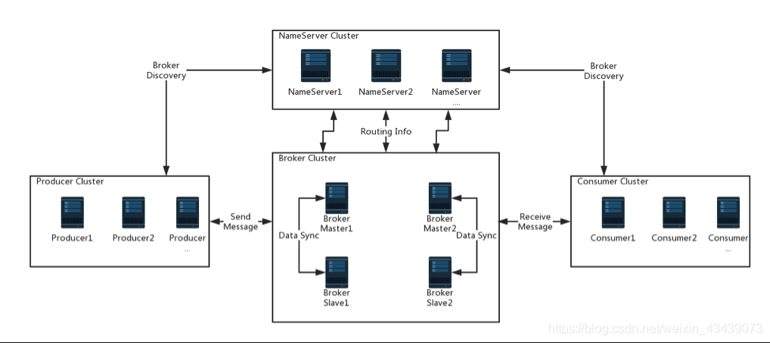
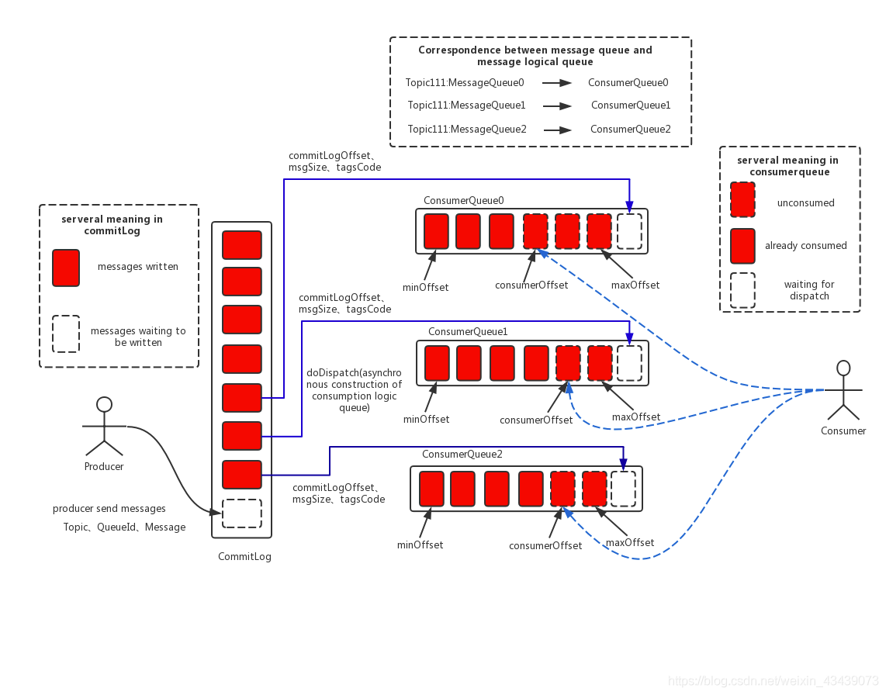
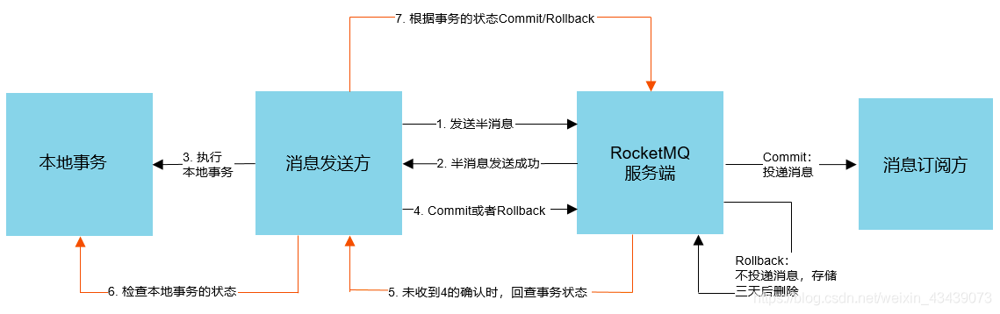
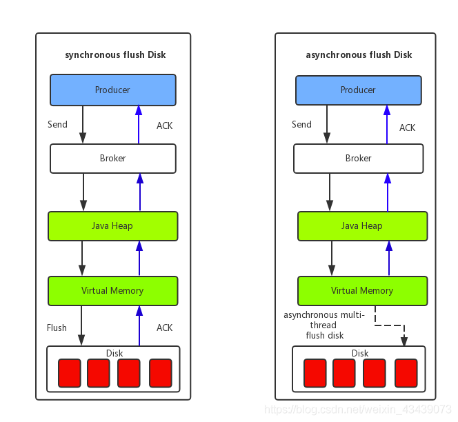
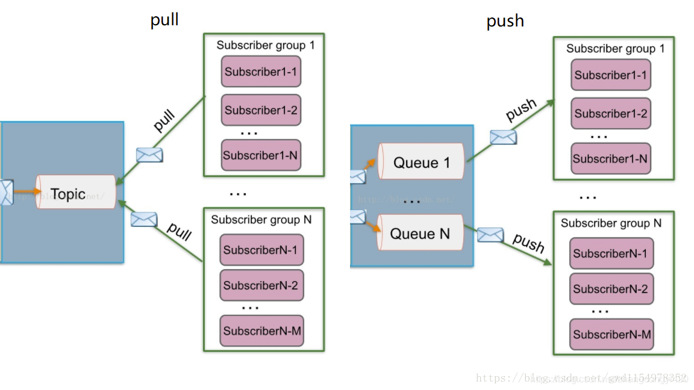

# 网络协议


- 物理层-网线层 最底层
- 数据链路层-交换机 mac
- 网络层-路由器 ip
- 传输层-端口
- 会话层-建立拆除会话链接
- 表示层-负责数据加密
- 应用层-接口


## tcp
- 可靠的
- 面向连接的
- 面向字节流
- 全双工


- 可靠性如何保证
  - 1.ack确认机制，收不到回调，过一点时间会重新发送
  - 2.文件大小校验，头部用两个字节记录了消息的大小
  - 3.需要解决乱序问题
  - 4.流量控制
  - 5.拥塞控制


- 流量控制

接收端在回复ack时，会将自己缓冲区的大小带上，返回给发送端。发送端根据缓冲区的空闲部分，调整发送策略
如果缓冲区大小为0，发送端就停止发送

## udp
- 1.无状态
- 2.不需要事先建立连接就可以发包
- 3.顺序发包、乱序收
- 4.没有确认机制，不保证消息一定到达


## TFO
能够让经历过一次正常的三次握手之后，能够在之后的三次我握手中，在发送第一个 SYN 包的时候就开始传数据了
是基于cookie实现的


## HTTP
TCP 是传输控制协议，基于 IP 协议来提供可靠的字节流形式的通信，是 HTTP 的基础，HTTP 不关心传输的细节，其实是运行在了 TCP 协议上
TCP工作在传输层，HTTP工作在应用层

# 一、源码解读

## tips

### 注解中可以使用
- 1.配置超链  <a href="https://www.baidu.com"></a>
- 2.配置要link的类  /** {@link XxxObject}*/

### dynamicTp中修改consumer的线程数
- 1.其实就是修改了 DefaultMQPushConsumer -> DefaultMQPushConsumerImpl -> ConsumeMessageService 实现类中的 consumeExecutor对象

### 打印当前服务的pid
```
    static {
        Supplier<Integer> supplier = () -> {
            String currentJVM = ManagementFactory.getRuntimeMXBean().getName();
            try {
                return Integer.parseInt(currentJVM.substring(0, currentJVM.indexOf('@')));
            } catch (Exception e) {
                return -1;
            }
        };
        System.out.printf("%s%n", supplier.get());
    }
```

## 一、启动

- 1.打包

`mvn -Prelease-all -DskipTests -Dspotbugs.skip=true clean install -U`

`cd distribution/target/rocketmq-5.1.0/rocketmq-5.1.0`

- 2.启动namesrv

`nohup sh bin/mqnamesrv &`

`tail -f ~/logs/rocketmqlogs/namesrv.log`

## 二、consumer流程

- 1.启动类example模块下，quickstart->Consumer类
- 2.定义`DefaultMQPushConsumer`类，指定nameSrv、topic、consumeFromWhere等属性后，start开始监听数据
- 3.start方法中，调用了`DefaultMQPushConsumerImpl`的start方法，`DefaultMQPushConsumerImpl`作为属性注册在了`DefaultMQPushConsumer`中
- 4.创建`DefaultMQPushConsumerImpl`时，又把`DefaultMQPushConsumer`作为属性注册到了`DefaultMQPushConsumerImpl`中
- 5.`DefaultMQPushConsumerImpl`的start方法，关键步骤如下
  - 1.通过`DefaultMQPushConsumer`创建类`MQClientInstance`对象
  - 2.通过监听器对象`MessageListenerConcurrently`创建`ConsumeMessageService`对象，具体的实现类这里为`ConsumeMessageConcurrentlyService`对象
  - 3.其中`ConsumeMessageConcurrentlyService`对象中创建了消费组线程池`consumeExecutor`，dynamicTp中修改rocketmq的线程池，就是修改的该对象
  - 4.在方法的结尾调用了`mQClientFactory.start();`方法，其就是`MQClientInstance`的start方法，在该方法内部又做了很多组件的启动，包括以下
    - 1.`mQClientAPIImpl.start();`consumer作为netty服务启动，可以和broker，nameSrv通信
    - 2.获取nameSrv的列表，每2分钟执行一次
    - 3.启动了一个单独的线程，不停的从自己维护的队列中拉取消息
    - 4.启动`RebalanceService`

- 问题1：Consumer类中`MessageListenerConcurrently`监听器是怎么就能打印拿到的消息的

- 1.入口：`Consumer`的`consumer.start();`
- 2.调用子类`defaultMQPushConsumerImpl.start();`
- 3.启动各组件`mQClientFactory.start();`
- 4.其中有一步为不停的获取消息 `MQClientInstance`中的`this.pullMessageService.start();`
- 5.具体调用的是`PullMessageService`类中的run方法
- 6.run方法中调用的是`this.pullMessage((PullRequest)messageRequest);`方法
- 7.接下来调用的是`DefaultMQPushConsumerImpl`的`pullMessage`方法
- 8.在`pullMessage`方法中定义了`PullCallback`对象，会异步触发回调
- 9.在`pullMessage`方法的最后调用了`this.pullAPIWrapper.pullKernelImpl`方法
- 10.在`pullKernelImpl`的最后调用了`this.mQClientFactory.getMQClientAPIImpl().pullMessage`获取`PullResult`对象
- 11.接下来调用`MQClientAPIImpl`的`pullMessageAsync`方法
- 12.接下来调用`this.remotingClient.invokeAsync`方法，**就是通过netty请求broker的数据**
- 13.在`operationComplete`回调方法中，会调用第8步中`PullCallback`的`onSuccess`方法，将请求到的数据传过去
- 14.在`onSuccess`中会调用`consumeMessageService.submitConsumeRequest`
- 15.走到`ConsumeMessageConcurrentlyService`类中的`submitConsumeRequest`方法，
- 16.再之后调用`consumeExecutor.submit(consumeRequest)`方法，这里是线程池submit一个任务，具体的逻辑在`ConsumeRequest`类的run方法中
- 17.在`ConsumeRequest`的run方法中，调用了`listener.consumeMessage`，即监听器的消费方法，最终就能打印消费到的消息


# 二、文档资料
## 一、基本原理及特性
### 1.文档、资料地址
- RocketMQ官网地址：https://rocketmq.apache.org/
- RocketMQ阿里云地址：https://help.aliyun.com/document_detail/29532.html?spm=a2c4g.11174283.6.542.628f449cbl8R3g
- RocketMQ gitHub地址：https://github.com/apache/rocketmq

### 2.架构设计

#### 1）结合部署架构图，描述集群工作流程：
启动NameServer，NameServer起来后监听端口，等待Broker、Producer、Consumer连上来，相当于一个路由控制中心。
Broker启动，跟所有的NameServer保持长连接，定时发送心跳包。心跳包中包含当前Broker信息(IP+端口等)以及存储所有Topic信息。注册成功后，NameServer集群中就有Topic跟Broker的映射关系。
收发消息前，先创建Topic，创建Topic时需要指定该Topic要存储在哪些Broker上，也可以在发送消息时自动创建Topic。
Producer发送消息，启动时先跟NameServer集群中的其中一台建立长连接，并从NameServer中获取当前发送的Topic存在哪些Broker上，轮询从队列列表中选择一个队列，然后与队列所在的Broker建立长连接从而向Broker发消息。
Consumer跟Producer类似，跟其中一台NameServer建立长连接，获取当前订阅Topic存在哪些Broker上，然后直接跟Broker建立连接通道，开始消费消息。
#### 2）Producer：
消息发布的角色，支持分布式集群方式部署。Producer通过MQ的负载均衡模块选择相应的Broker集群队列进行消息投递，投递的过程支持快速失败并且低延迟。
#### 3）Consumer：
消息消费的角色，支持分布式集群方式部署。支持以push推，pull拉两种模式对消息进行消费。同时也支持集群方式和广播方式的消费，它提供实时消息订阅机制，可以满足大多数用户的需求。
#### 4）NameServer 主要包括两个功能:
Broker管理：NameServer接受Broker集群的注册信息并且保存下来作为路由信息的基本数据。然后提供心跳检测机制，检查Broker是否还存活；
路由信息管理：每个NameServer将保存关于Broker集群的整个路由信息和用于客户端查询的队列信息。
#### 5）Broker：Broker主要负责消息的存储、投递和查询以及服务高可用
Broker部署相对复杂，Broker分为Master与Slave，一个Master可以对应多个Slave，但是一个Slave只能对应一个Master，Master与Slave 的对应关系通过指定相同的BrokerName，不同的BrokerId 来定义，BrokerId为0表示Master，非0表示Slave。Master也可以部署多个。每个Broker与NameServer集群中的所有节点建立长连接，定时注册Topic信息到所有NameServer。

### 3.应用场景
#### 削峰填谷
诸如秒杀、抢红包、企业开门红等大型活动时皆会带来较高的流量脉冲，或因没做相应的保护而导致系统超负荷甚至崩溃，或因限制太过导致请求大量失败而影响用户体验，消息队列RocketMQ版可提供削峰填谷的服务来解决该问题。
#### 异步解耦
交易系统作为淘宝和天猫主站最核心的系统，每笔交易订单数据的产生会引起几百个下游业务系统的关注，包括物流、购物车、积分、流计算分析等等，整体业务系统庞大而且复杂，消息队列RocketMQ版可实现异步通信和应用解耦，确保主站业务的连续性。
#### 顺序收发
细数日常中需要保证顺序的应用场景非常多，例如证券交易过程时间优先原则，交易系统中的订单创建、支付、退款等流程，航班中的旅客登机消息处理等等。与先进先出FIFO（First In First Out）原理类似，消息队列RocketMQ版提供的顺序消息即保证消息FIFO。
#### 分布式事务一致性
交易系统、支付红包等场景需要确保数据的最终一致性，大量引入消息队列RocketMQ版的分布式事务，既可以实现系统之间的解耦，又可以保证最终的数据一致性。
### 4.特点
- 分布式事务消息：实现类似 X/Open XA 的分布事务功能，以达到事务最终一致性状态。
- 定时（延时）消息：允许消息生产者指定消息进行定时（延时）投递，最长支持 40 天。
- 大消息：支持最大 4 MB 消息。
- 消息轨迹：通过消息轨迹，能清晰定位消息从发布者发出，经由消息队列 RocketMQ 服务端，投递给消息订阅者的完整链路，方便定位排查问题。
- 广播消费：允许同一个 Group ID 所标识的所有 Consumer 都各自消费某条消息一次。
- 顺序消息：允许消息消费者按照消息发送的顺序对消息进行消费。
- 重置消费进度：根据时间重置消费进度，允许用户进行消息回溯或者丢弃堆积消息。
- 死信队列：将无法正常消费的消息储存到特殊的死信队列供后续处理。
- 全球消息路由：用于全球不同地域之间的消息同步复制，保证地域之间的数据一致性。
### 5.名词解释
#### 1）Message Trace （消息轨迹）
在一条消息从生产者发出到订阅者消费处理过程中，由各个相关节点的时间、地点等数据汇聚而成的完整链路信息。通过消息轨迹，您能清晰定位消息从生产者发出，经由消息队列 RocketMQ 服务端，投递给消息消费者的完整链路，方便定位排查问题。

#### 2）Reset Consumer Locus （重置消费位点）
以时间轴为坐标，在消息持久化存储的时间范围内（默认 3 天），重新设置消息消费者对其订阅 Topic 的消费进度，
设置完成后订阅者将接收设定时间点之后由消息生产者发送到消息队列 RocketMQ 服务端的消息。

#### 3）Dead Letter Queue （死信队列）
死信队列用于处理无法被正常消费的消息。当一条消息初次消费失败，消息队列 RocketMQ 会自动进行消息重试；达到最大重试次数（默认16次）后，若消费依然失败，则表明消费者在正常情况下无法正确地消费该消息，此时，消息队列 RocketMQ 不会立刻将消息丢弃，而是将其发送到该消费者对应的特殊队列中。
消息队列 RocketMQ 将这种正常情况下无法被消费的消息称为死信消息（Dead-Letter Message）
消息队列 RocketMQ 将存储死信消息的特殊队列称为死信队列（Dead-Letter Queue）。

## 二、进阶
### 1.消息存储

消息存储架构图中主要有下面三个跟消息存储相关的文件构成。
#### (1) CommitLog：
- 消息主体以及元数据的存储主体，存储Producer端写入的消息主体内容,消息内容不是定长的。
- 单个文件大小默认1G ，文件名长度为20位，左边补零，剩余为起始偏移量，比如00000000000000000000代表了第一个文件，起始偏移量为0，文件大小为1G=1073741824；当第一个文件写满了，第二个文件为00000000001073741824，起始偏移量为1073741824，以此类推。消息主要是顺序写入日志文件，磁盘顺序写速度特别快，这也是RocketMQ高性能的原因，当文件满了，写入下一个文件；
#### (2) ConsumeQueue：
- 消息消费队列，引入的目的主要是提高消息消费的性能，由于RocketMQ是基于主题topic的订阅模式，消息消费是针对主题进行的，如果要遍历commitlog文件中根据topic检索消息是非常低效的。
- Consumer即可根据ConsumeQueue来查找待消费的消息。其中，ConsumeQueue（逻辑消费队列）作为消费消息的索引，保存了指定Topic下的队列消息在CommitLog中的起始物理偏移量offset，消息大小size和消息Tag的HashCode值。consumequeue文件可以看成是基于topic的commitlog索引文件，故consumequeue文件夹的组织方式如：topic/queue/file三层组织结构.
- 具体存储路径为：$HOME/store/consumequeue/{topic}/{queueId}/{fileName}。同样consumequeue文件采取定长设计，每一个条目共20个字节，分别为8字节的commitlog物理偏移量、4字节的消息长度、8字节tag hashcode，单个文件由30W个条目组成，可以像数组一样随机访问每一个条目，每个ConsumeQueue文件大小约5.72M；
#### (3) IndexFile：
- IndexFile（索引文件）提供了一种可以通过key或时间区间来查询消息的方法。
- Index文件的存储位置是：$HOME \store\index${fileName}，文件名fileName是以创建时的时间戳命名的，固定的单个IndexFile文件大小约为400M，一个IndexFile可以保存 2000W个索引，IndexFile的底层存储设计为在文件系统中实现HashMap结构，故rocketmq的索引文件其底层实现为hash索引。
### 2.事物消息

- 发送方向消息队列 RocketMQ 服务端发送消息。
- 服务端将消息持久化成功之后，向发送方 ACK 确认消息已经发送成功，此时消息为半消息。
- 发送方开始执行本地事务逻辑。
- 发送方根据本地事务执行结果向服务端提交二次确认（Commit 或是 Rollback），服务端收到 Commit 状态则将半消息标记为可投递，订阅方最终将收到该消息；服务端收到 Rollback 状态则删除半消息，订阅方将不会接受该消息。
- 在断网或者是应用重启的特殊情况下，上述步骤 4 提交的二次确认最终未到达服务端，经过固定时间后服务端将对该消息发起消息回查。
- 发送方收到消息回查后，需要检查对应消息的本地事务执行的最终结果。
- 发送方根据检查得到的本地事务的最终状态再次提交二次确认，服务端仍按照步骤 4 对半消息进行操作。
### 3.消息刷盘

#### (1) 同步刷盘：如上图所示，只有在消息真正持久化至磁盘后RocketMQ的Broker端才会真正返回给Producer端一个成功的ACK响应。同步刷盘对MQ消息可靠性来说是一种不错的保障，但是性能上会有较大影响，一般适用于金融业务应用该模式较多。
#### (2) 异步刷盘：能够充分利用OS的PageCache的优势，只要消息写入PageCache即可将成功的ACK返回给Producer端。消息刷盘采用后台异步线程提交的方式进行，降低了读写延迟，提高了MQ的性能和吞吐量。


### 4.消息过滤
Tag过滤方式：Consumer端在订阅消息时除了指定Topic还可以指定TAG，如果一个消息有多个TAG，可以用||分隔。其中，Consumer端会将这个订阅请求构建成一个 SubscriptionData，发送一个Pull消息的请求给Broker端。Broker端从RocketMQ的文件存储层—Store读取数据之前，会用这些数据先构建一个MessageFilter，然后传给Store。Store从 ConsumeQueue读取到一条记录后，会用它记录的消息tag hash值去做过滤，由于在服务端只是根据hashcode进行判断，无法精确对tag原始字符串进行过滤，故在消息消费端拉取到消息后，还需要对消息的原始tag字符串进行比对，如果不同，则丢弃该消息，不进行消息消费。

### 5.负载均衡
- 通过Topic在多Broker中分布式存储实现
- producer端 默认策略是随机选择：
- producer维护一个index
- 每次取节点会自增
- index向所有broker个数取余
- 自带容错策略
- consumer端 默认是平均分配算法
- 其他负载均衡算法：环形分配策略(AllocateMessageQueueAveragelyByCircle) 手动配置分配策略(AllocateMessageQueueByConfig) 机房分配策略(AllocateMessageQueueByMachineRoom) 一致性哈希分配策略(AllocateMessageQueueConsistentHash) 靠近机房策略(AllocateMachineRoomNearby)

## 三、常见问题
### 1.Consumer是如何从Broker获取消息的？Push or Pull?
- RocketMQ没有真正意义的push，都是pull，虽然有push类，但实际底层实现采用的是长轮询机制，即拉取方式
- push方式里，consumer把轮询过程封装了，并注册MessageListener监听器，取到消息后，唤醒MessageListener的consumeMessage()来消费，对用户而言，感觉消息是被推送过来的。
- pull方式里，取消息的过程需要用户自己写，首先通过打算消费的Topic拿到MessageQueue的集合，遍历MessageQueue集合，然后针对每个MessageQueue批量取消息，一次取完后，记录该队列下一次要取的开始offset，直到取完了，再换另一个MessageQueue。
- 从下面这张简单的示意图也可以大致看出其中的差别，相当于是说，push的方式是：消息发送到broker后，如果是push，则broker会主动把消息推送给consumer即topic中，而pull的方式是:消息投递到broker后，消费端需要主动去broker上拉消息，即需要手动写代码实现，


### 2.如何保证消息可靠性
#### 1.Producer端：
采取send()同步发消息，发送结果是同步感知的。
发送失败后可以重试，设置重试次数。默认3次。
#### 2.Broker
修改刷盘策略为同步刷盘。默认情况下是异步刷盘的。
集群部署，主从模式，高可用。
#### 3.Consumer端
完全消费正常后在进行手动ack确认。
### 3.rocketMQ的消息堆积如何处理
- consumer水平扩容，即上线更多consumer来消费消息
- 如果Consumer和Queue不对等，上线了多台也在短时间内无法消费完堆积的消息怎么办？
- 准备一个临时的topic
- queue的数量是堆积的几倍
- queue分布到多Broker中
- 上线一台Consumer做消息的搬运工，把原来Topic中的消息挪到新的Topic里，不做业务逻辑处理，只是挪过去
- 上线N台Consumer同时消费临时Topic中的数据
- 改bug
- 恢复原来的Consumer，继续消费之前的Topic
### 4.customer和queue的对应关系
https://blog.csdn.net/qq_34930488/article/details/101282436
### 5.顺序消息是怎么实现的
https://www.zhihu.com/question/30195969

## 四、如何设计消息中间件
本质：一种具备接受请求、保存数据、发送数据等功能的网络应用
### 1.高可用
1）主从模式
2）可横向扩展
### 2.高可靠
1）消息传输高可靠
2）消息存储高可靠
### 3.协议
提高各组件之间的通信速度
### 4.消息分发
消息分发主要保证的就是，一条消息到底要发送给谁去消费，以及采用何用策略去分配，对于一个消费失败的数据是否可以进行重发等


## Apache RocketMQ

[![Build Status][maven-build-image]][maven-build-url]
[![CodeCov][codecov-image]][codecov-url]
[![Maven Central][maven-central-image]][maven-central-url]
[![Release][release-image]][release-url]
[![License][license-image]][license-url]
[![Average Time to Resolve An Issue][percentage-of-issues-still-open-image]][pencentage-of-issues-still-open-url]
[![Percentage of Issues Still Open][average-time-to-resolve-an-issue-image]][average-time-to-resolve-an-issue-url]
[![Twitter Follow][twitter-follow-image]][twitter-follow-url]

**[Apache RocketMQ](https://rocketmq.apache.org) is a distributed messaging and streaming platform with low latency, high performance and reliability, trillion-level capacity and flexible scalability.**


It offers a variety of features:

* Messaging patterns including publish/subscribe, request/reply and streaming
* Financial grade transactional message
* Built-in fault tolerance and high availability configuration options base on [DLedger Controller](docs/en/controller/quick_start.md)
* Built-in message tracing capability, also support opentracing
* Versatile big-data and streaming ecosystem integration
* Message retroactivity by time or offset
* Reliable FIFO and strict ordered messaging in the same queue
* Efficient pull and push consumption model
* Million-level message accumulation capacity in a single queue
* Multiple messaging protocols like gRPC, MQTT, JMS and OpenMessaging
* Flexible distributed scale-out deployment architecture
* Lightning-fast batch message exchange system
* Various message filter mechanics such as SQL and Tag
* Docker images for isolated testing and cloud isolated clusters
* Feature-rich administrative dashboard for configuration, metrics and monitoring
* Authentication and authorization
* Free open source connectors, for both sources and sinks
* Lightweight real-time computing
----------


## Quick Start

This paragraph guides you through steps of installing RocketMQ in different ways.
For local development and testing, only one instance will be created for each component.

### Run RocketMQ locally

RocketMQ runs on all major operating systems and requires only a Java JDK version 8 or higher to be installed.
To check, run `java -version`:
```shell
$ java -version
java version "1.8.0_121"
```

For Windows users, click [here](https://archive.apache.org/dist/rocketmq/4.9.4/rocketmq-all-4.9.4-bin-release.zip) to download the 4.9.4 RocketMQ binary release,
unpack it to your local disk, such as `D:\rocketmq`.
For macOS and Linux users, execute following commands:
```shell
# Download release from the Apache mirror
$ wget https://archive.apache.org/dist/rocketmq/4.9.4/rocketmq-all-4.9.4-bin-release.zip

# Unpack the release
$ unzip rocketmq-all-4.9.4-bin-release.zip
```

Prepare a terminal and change to the extracted `bin` directory:
```shell
$ cd rocketmq-4.9.4/bin
```

**1) Start NameServer**

NameServer will be listening at `0.0.0.0:9876`, make sure that the port is not used by others on the local machine, and then do as follows.

For macOS and Linux users:
```shell
### start Name Server
$ nohup sh mqnamesrv &

### check whether Name Server is successfully started
$ tail -f ~/logs/rocketmqlogs/namesrv.log
The Name Server boot success...
```

For Windows users, you need set environment variables first:
- From the desktop, right click the Computer icon.
- Choose Properties from the context menu.
- Click the Advanced system settings link.
- Click Environment Variables.
- Add Environment `ROCKETMQ_HOME="D:\rocketmq"`. 

Then change directory to rocketmq, type and run:
```shell
$ mqnamesrv.cmd
The Name Server boot success...
```

**2) Start Broker**

For macOS and Linux users:
```shell
### start Broker
$ nohup sh bin/mqbroker -n localhost:9876 &

### check whether Broker is successfully started, eg: Broker's IP is 192.168.1.2, Broker's name is broker-a
$ tail -f ~/logs/rocketmqlogs/broker.log
The broker[broker-a, 192.169.1.2:10911] boot success...
```

For Windows users:
```shell
$ mqbroker.cmd -n localhost:9876
The broker[broker-a, 192.169.1.2:10911] boot success...
```

### Run RocketMQ in Docker

You can run RocketMQ on your own machine within Docker containers,
`host` network will be used to expose listening port in the container.

**1) Start NameServer**

```shell
$ docker run -it --net=host apache/rocketmq ./mqnamesrv
```

**2) Start Broker**

```shell
$ docker run -it --net=host --mount source=/tmp/store,target=/home/rocketmq/store apache/rocketmq ./mqbroker -n localhost:9876
```

### Run RocketMQ in Kubernetes

You can also run a RocketMQ cluster within a Kubernetes cluster using [RocketMQ Operator](https://github.com/apache/rocketmq-operator).
Before your operations, make sure that `kubectl` and related kubeconfig file installed on your machine.

**1) Install CRDs**
```shell
### install CRDs
$ git clone https://github.com/apache/rocketmq-operator
$ cd rocketmq-operator && make deploy

### check whether CRDs is successfully installed
$ kubectl get crd | grep rocketmq.apache.org
brokers.rocketmq.apache.org                 2022-05-12T09:23:18Z
consoles.rocketmq.apache.org                2022-05-12T09:23:19Z
nameservices.rocketmq.apache.org            2022-05-12T09:23:18Z
topictransfers.rocketmq.apache.org          2022-05-12T09:23:19Z

### check whether operator is running
$ kubectl get pods | grep rocketmq-operator
rocketmq-operator-6f65c77c49-8hwmj   1/1     Running   0          93s
```

**2) Create Cluster Instance**
```shell
### create RocketMQ cluster resource
$ cd example && kubectl create -f rocketmq_v1alpha1_rocketmq_cluster.yaml

### check whether cluster resources is running
$ kubectl get sts
NAME                 READY   AGE
broker-0-master      1/1     107m
broker-0-replica-1   1/1     107m
name-service         1/1     107m
```

---
## Apache RocketMQ Community
* [RocketMQ Streams](https://github.com/apache/rocketmq-streams): A lightweight stream computing engine based on Apache RocketMQ.
* [RocketMQ Flink](https://github.com/apache/rocketmq-flink): The Apache RocketMQ connector of Apache Flink that supports source and sink connector in data stream and Table.
* [RocketMQ APIs](https://github.com/apache/rocketmq-apis): RocketMQ protobuf protocol.
* [RocketMQ Clients](https://github.com/apache/rocketmq-clients): gRPC/protobuf-based RocketMQ clients.
* RocketMQ Remoting-based Clients
	 - [RocketMQ Client CPP](https://github.com/apache/rocketmq-client-cpp)
	 - [RocketMQ Client Go](https://github.com/apache/rocketmq-client-go)
	 - [RocketMQ Client Python](https://github.com/apache/rocketmq-client-python)
	 - [RocketMQ Client Nodejs](https://github.com/apache/rocketmq-client-nodejs)
* [RocketMQ Spring](https://github.com/apache/rocketmq-spring): A project which helps developers quickly integrate Apache RocketMQ with Spring Boot.
* [RocketMQ Exporter](https://github.com/apache/rocketmq-exporter): An Apache RocketMQ exporter for Prometheus.
* [RocketMQ Operator](https://github.com/apache/rocketmq-operator): Providing a way to run an Apache RocketMQ cluster on Kubernetes.
* [RocketMQ Docker](https://github.com/apache/rocketmq-docker): The Git repo of the Docker Image for Apache RocketMQ.
* [RocketMQ Dashboard](https://github.com/apache/rocketmq-dashboard): Operation and maintenance console of Apache RocketMQ.
* [RocketMQ Connect](https://github.com/apache/rocketmq-connect): A tool for scalably and reliably streaming data between Apache RocketMQ and other systems.
* [RocketMQ MQTT](https://github.com/apache/rocketmq-mqtt): A new MQTT protocol architecture model, based on which Apache RocketMQ can better support messages from terminals such as IoT devices and Mobile APP.
* [RocketMQ Incubating Community Projects](https://github.com/apache/rocketmq-externals): Icubator community projects of Apache RocketMQ, including [logappender](https://github.com/apache/rocketmq-externals/tree/master/logappender), [rocketmq-ansible](https://github.com/apache/rocketmq-externals/tree/master/rocketmq-ansible), [rocketmq-beats-integration](https://github.com/apache/rocketmq-externals/tree/master/rocketmq-beats-integration), [rocketmq-cloudevents-binding](https://github.com/apache/rocketmq-externals/tree/master/rocketmq-cloudevents-binding), etc.
* [RocketMQ Site](https://github.com/apache/rocketmq-site): The repository for Apache RocketMQ website.


----------
## Learn it & Contact us
* Mailing Lists: <https://rocketmq.apache.org/about/contact/>
* Home: <https://rocketmq.apache.org>
* Docs: <https://rocketmq.apache.org/docs/quick-start/>
* Issues: <https://github.com/apache/rocketmq/issues>
* Rips: <https://github.com/apache/rocketmq/wiki/RocketMQ-Improvement-Proposal>
* Ask: <https://stackoverflow.com/questions/tagged/rocketmq>
* Slack: <https://rocketmq-invite-automation.herokuapp.com/>
 

----------


## Contributing
We always welcome new contributions, whether for trivial cleanups, [big new features](https://github.com/apache/rocketmq/wiki/RocketMQ-Improvement-Proposal) or other material rewards, more details see [here](http://rocketmq.apache.org/docs/how-to-contribute/).
 
----------
## License
[Apache License, Version 2.0](http://www.apache.org/licenses/LICENSE-2.0.html) Copyright (C) Apache Software Foundation


----------
## Export Control Notice
This distribution includes cryptographic software. The country in which you currently reside may have
restrictions on the import, possession, use, and/or re-export to another country, of encryption software.
BEFORE using any encryption software, please check your country's laws, regulations and policies concerning
the import, possession, or use, and re-export of encryption software, to see if this is permitted. See
<http://www.wassenaar.org/> for more information.

The U.S. Government Department of Commerce, Bureau of Industry and Security (BIS), has classified this
software as Export Commodity Control Number (ECCN) 5D002.C.1, which includes information security software
using or performing cryptographic functions with asymmetric algorithms. The form and manner of this Apache
Software Foundation distribution makes it eligible for export under the License Exception ENC Technology
Software Unrestricted (TSU) exception (see the BIS Export Administration Regulations, Section 740.13) for
both object code and source code.

The following provides more details on the included cryptographic software:

This software uses Apache Commons Crypto (https://commons.apache.org/proper/commons-crypto/) to
support authentication, and encryption and decryption of data sent across the network between
services.

[maven-build-image]: https://github.com/apache/rocketmq/actions/workflows/maven.yaml/badge.svg
[maven-build-url]: https://github.com/apache/rocketmq/actions/workflows/maven.yaml
[codecov-image]: https://codecov.io/gh/apache/rocketmq/branch/master/graph/badge.svg
[codecov-url]: https://codecov.io/gh/apache/rocketmq
[maven-central-image]: https://maven-badges.herokuapp.com/maven-central/org.apache.rocketmq/rocketmq-all/badge.svg
[maven-central-url]: http://search.maven.org/#search%7Cga%7C1%7Corg.apache.rocketmq
[release-image]: https://img.shields.io/badge/release-download-orange.svg
[release-url]: https://www.apache.org/licenses/LICENSE-2.0.html
[license-image]: https://img.shields.io/badge/license-Apache%202-4EB1BA.svg
[license-url]: https://www.apache.org/licenses/LICENSE-2.0.html
[average-time-to-resolve-an-issue-image]: http://isitmaintained.com/badge/resolution/apache/rocketmq.svg
[average-time-to-resolve-an-issue-url]: http://isitmaintained.com/project/apache/rocketmq
[percentage-of-issues-still-open-image]: http://isitmaintained.com/badge/open/apache/rocketmq.svg
[pencentage-of-issues-still-open-url]: http://isitmaintained.com/project/apache/rocketmq
[twitter-follow-image]: https://img.shields.io/twitter/follow/ApacheRocketMQ?style=social
[twitter-follow-url]: https://twitter.com/intent/follow?screen_name=ApacheRocketMQ
